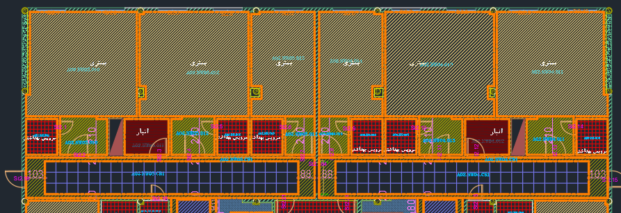

**پیش‌نوشت یک:** در این مطلب سعی می‌کنم مفاهیم رو به صورت کلی و بدون اتکا به زبان برنامه‌نویسی خاصی توضیح بدهم. خودم بخاطر تجربه قبلی که با پایتون داشتم و کامیونیتی قوی و بالاخص کتابخانه‌های زیاد که به شدت میتونه سرعت توسعه رو افزایش بده از این زبان استفاده کردم.

**پیش‌نوشت دو:‌** مفاهیم زیادی در این بخش وجود داره که نیاز داره به صورت جامع و کامل در موردش توضیح داده بشه اما بخاطر اینکه ممکنه از این بحث منحرف بشیم به یک توضیح کوتاه در مورد اون در این بخش بسنده می‌کنم و احتمالا در پست‌هایی جداگانه در مورد اونها به صورت جامع و کامل و توضیح خواهم داد. 


یک پروژه‌ای به دست من رسید که لازم بود در مدت زمان کم متره رنگ پروژه بیمارستانی را انجام دهم. بیمارستان‌ها معمولا بخش‌های مختلفی مثل انبار، رختکن، اتاق جراحی و ... دارند. این تقسیم بندی‌ها در نقشه انجام شده بود. 


همونطور که در تصویر مشخصه هر بخش یک اسم فارسی، یک کد مخصوص به خود، درب، پنجره، کناف، سقف، دیوار  و مشخصات دیگری داره که ممکنه همه‌ی اونها رو شما در این تصویر نبینید و در بخش‌های دیگر نقشه مشهود باشه. حل کردن این مسئله به عنوان یک مسئله برنامه‌نویسی برای خودم جذابیت بیشتری داشت تا در نظرگرفتن اون به‌عنوان یک مسئله متره و برآوردی. خب بریم سراغ حل مسئله. زمانی که ما خودمون می‌خواهیم این مسئله رو حل کنیم اول یک درکی از نقشه سازه با استفاده از مشاهده اون و درک و استنباط مهندسی خودمون میتونیم این کار رو انجام بدیم اما زمانی که از کامپیوتر می‌خواهیم این مسئله رو برامون حل کنه اون فقط یک فایل کد رو می‌بینه -البته فعلا ما فرض اینکه یک مدل شبکه عصبی داریم که ‌می‌تونیم هم بهش عکس و هم فایل کد رو میگیریم رو کنار گذاشتیم -. پس ما الان فقط یک فایل کد داریم. 
در فایل کد ما یک مفهومی داریم به نام entity که بیان‌کننده یک واحد مجزا در نقشه‌های کد است. از جمله: TEXT, MTEXT, INSERT, LINESTRING,  POLYGON. برای اینکه که اطلاعات یک فایل کد رو بخونیم دو راه (یا بیشتر) داریم: یک راه اینه که اتوکد رو باز کنیم و از طریق api اتوکد با فایل کد تعامل داشته باشیم که این راه از نظر من کنده. راه دیگه اینه که فایل کد رو مستقیم بخونیم. مسئله دیگری که اینجا پیش می‌آید اینه که فایل اتوکد را با چه فرمتی ذخیره کنیم تا اونو بخونیم؟ ما یک فایل کد رو به فرمت‌های مختلف می‌تونیم ذخیره کنیم مانند dxf , dwg و غیره. اگه دقت کرده باشید همین فایل‌ها رو هم می‌تونیم به ورژن‌های مختلفی که دارن ذخیره کنیم. جالبه بدونید که .bak، .dws، .dwt، sv$ هم DWG محسوب میشن ([+](https://en.wikipedia.org/wiki/.dwg)).  در مورد DWG تا به حال اتودسک سندی رو به صورت عمومی در مورد اون منتشر نکرده که مستندات اون رو در اختیار بقیه قرار بده. پس این گزینه حذف میشه؛ هرچند تلاش‌هایی در جهت مهندسی معکوس فایل‌های با این فرمت توسط شرکت‌هایی مثل [ODA](https://www.opendesign.com) انجام شده اما اون هم چالش‌های خودشو داشته. تنها گزینه‌ای که فعلا با اون میتونیم کار کنیم DXF که تعریف اون رو با هم از ویکی‌پدیا می‌بینیم:

> AutoCAD DXF  یک فرمت فایل داده‌های CAD است که توسط اتودسک توسعه یافته تا امکان تبادل داده بین اتوکد و سایر برنامه‌ها را فراهم کند. فرمت DXF در دسامبر ۱۹۸۲ به عنوان بخشی از اتوکد نسخه 1.0 معرفی شد و هدف آن ارائه نمایش دقیقی از داده‌های موجود در فرمت فایل بومی اتوکد یعنی DWG  بود. سال‌ها اتودسک مشخصات فنی DXF را منتشر نمی‌کرد که این موضوع ایمپورت صحیح فایل‌های DXF را دشوار می‌ساخت. اکنون اتودسک مشخصات DXF را به‌صورت آنلاین منتشر می‌کند.

همونطور که در این متن ذکر شده شرکت اتودسک مستنداتی رو درباره فرمت DFX منتشر میکنه ([+](https://help.autodesk.com/view/OARX/2018/ENU/?guid=GUID-235B22E0-A567-4CF6-92D3-38A2306D73F3)) اما کامل نیست!
در مستندات کتابخانه ezdxf ([+](https://ezdxf.readthedocs.io/en/stable/concepts/dxf.html)) ذکر شده که:

> مرجع DXF به هیچ وجه مشخصه یا استانداردی مانند استاندارد W3C برای SVG یا استاندارد ISO برای PDF نیست. مرجع، بسیاری از واحدهای DXF و همچنین برخی مفاهیم پایه‌ای مانند ساختار تگ یا الگوریتم محور دلخواه را توصیف می‌کند، اما نه همه‌ی آن‌ها. با این حال، مستندات موجود (مرجع) ناقص بوده و تا حدی گمراه‌کننده یا نادرست است. همچنین از مرجع برخی بخش‌های مهم مانند روابط پیچیده بین واحدها برای ایجاد ساختارهای بالاتر مانند تعاریف بلوک، نماها (فضای مدل و فضای کاغذ) یا بلوک‌های دینامیک به عنوان نمونه حذف شده‌اند.

**همونطور که شما هم احتمالا متوجه شدید ما الان داریم نقشه‌هایمان در فرمت‌هایی ذخیره می‌کنیم که کاملا در انحصار شرکت اتودسک هست و اگر مشکلی برای برنامه اتودسک اتوکد ما پیش بیاد و بخواهیم فایل‌های موجود را با برنامه‌های دیگر موجود باز کنیم احتمال وجود عدم سازگاری هست.**

خب بعد اینکه ما فایل DXF رو دریافت کردیم نیاز هست که واحدهای DXF رو که موردنیازمون هست رو دریافت کنیم. برای اینکار من در پایتون از کتابخانه ezdxf  استفاده کردم. در اینجا ما میتونیم کوئری هم بنویسیم که المان‌هایی که موردنیازمون هست رو بر اساس لایه مدنظر و دیگر مشخصات دریافت کنیم.

```python
 window_blocks = modelspace.query("INSERT[layer=='A-GLAZ']")
 door_blocks = modelspace.query("INSERT[layer=='A-DOOR']")
 opening_blocks = modelspace.query("LWPOLYLINE[layer=='Temp-Opening']")
```
		
تا اینجا ما یه‌سری لیبل داریم که میدونم مربوط به در، پنجره، بازشو یا بخش مربوطه هستند. برای گرفتن بخش مربوطه هم مشخصات HATCH رو خوندیم و تبدیل به POLYGON کردیم. برای کار با اشکال هندسی در پایتون و سهولت محاسبات از کتابخانه shapely ([+](https://shapely.readthedocs.io/en/stable/)) استفاده کردیم. این کتابخانه سرعت ما را در کار با اشکال هندسی خیلی بالا می‌بره. در پستی جداگانه حتما در مورد این کتابخانه توضیح میدم و این کتابخانه کمتر شناخته شده هستش در صورتی که کاربرد بسیار زیادی در کارهای مهندسی داره. حالا برای مربوط کردن لیبل‌ها به اجزای مربوطه (مانند در و پنجره) میتونیم از طلاقی بین لیبل و بلوک در یا پنجره مربوطه به ارتباط بین این دو پی ببریم. همچنین برای ارتباط بازشو، در و پنجره هم از همین تکنیک میتونیم استفاده کنیم.  
```python
# Relate windows to hatches
    for window in structure.windows:
        window_boundary = window["boundary"]
        possible_matches = list(idx.intersection(window_boundary.bounds))
        for i in possible_matches:
            hatch = hatch_map[i]
            if hatch["boundary"].intersects(window_boundary):
                hatch["windows"].append(window["content"])
```

**یه دیدگاه خوب اینه که زمانی که داریم برنامه‌هامونو توسعه میدیم به فکر مقیاس‌پذیری اون هم باشیم.** 
اگر تعداد لیبل‌ها و دیگر اجزا زیاد باشد و ما بخواهیم یک لیبل را با تمام اجزا برای برخورد با یکدیگر چک کنیم سرعت برنامه ما خیلی کند میشود. در اینجا جای خالی یک ابزار احساس میشه. اینجا ما نیاز به یک پایگاه داده مکانی داریم که سرعت کار ما رو به شدت بالا میبره. ویکی‌پدیا پایگاه داده مکانی رو اینجور تعریف میکنه:
> پایگاه داده مکانی یا فضایی (انگلیسی: Spatial database) و یا پایگاه داده جغرافیایی(Geodatabase) نوعی پایگاه داده است که به‌منظور دخیره‌سازی و جستجو در داده‌های دارای اطلاعات موقعیت مکانی و جغرافیایی و فضای هندسی بهینه‌سازی شده است. بیشتر پایگاه‌های داده‌های جغرافیایی و فضایی قادر به نمایش موضوعات ساده هندسی مانند نقطه، خط و چندضلعی هستند. برخی پایگاه‌های داده‌های فضایی دیگر می‌توانند ساختارهای پیچیده‌تری مانند پدیده‌های سه‌بعدی، پوشش‌های توپولوژی، شبکه‌های خطی و شبکه‌های نامنظم مثلثی را مدیریت کنند.

با استفاده از این پایگاه ما میتونیم بررسی کنیم که برای لیبل مدنظر ما چندتا تقاطع با دیگر اجزا داریم و صحت آنرا با استفاده از shapely  بررسی کردیم. برای به‌کاربردن این تکنیک از کتابخانه rtree ([+](https://rtree.readthedocs.io/en/latest/)) در پایتون استفاده شد. یک چالش قشنگ دیگری  در این پروژه وجود داشت که نیاز بود کناف‌ها به اجزای مستطیلی مجزا تقسیم‌بندی شود. این کار برای ما راحته اما برنامه ما چطور میتواند این کار را برای ما انجام دهد؟ اینجاست که هندسه محاسباتی ([+](https://en.wikipedia.org/wiki/Computational_geometry)) به کمک ما می‌آید. 
David Eppstein (+)  در مقاله‌اش (+) پاسخ این مسئله را داده است.

